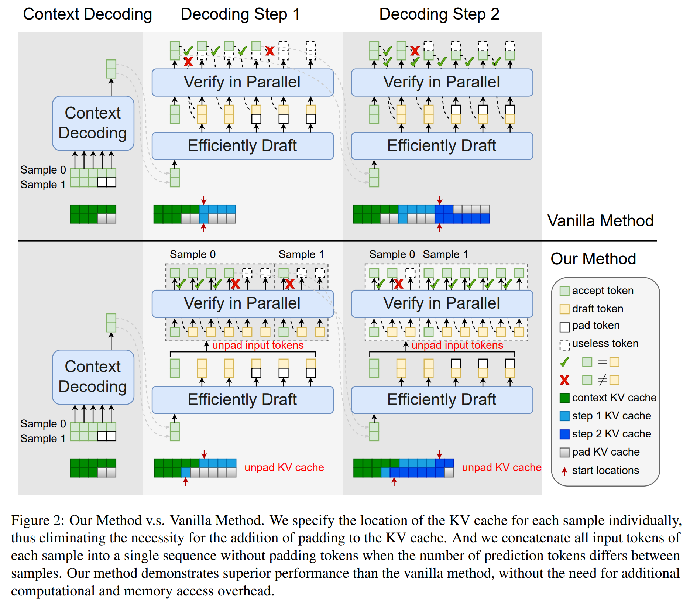
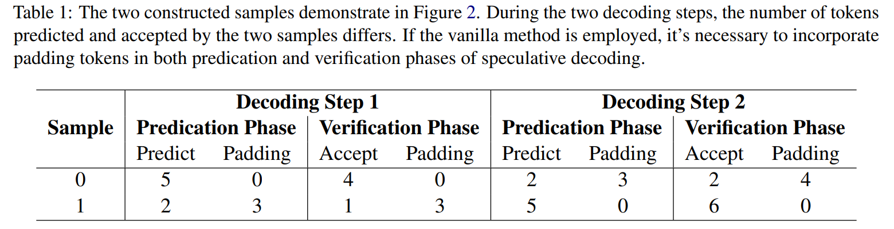
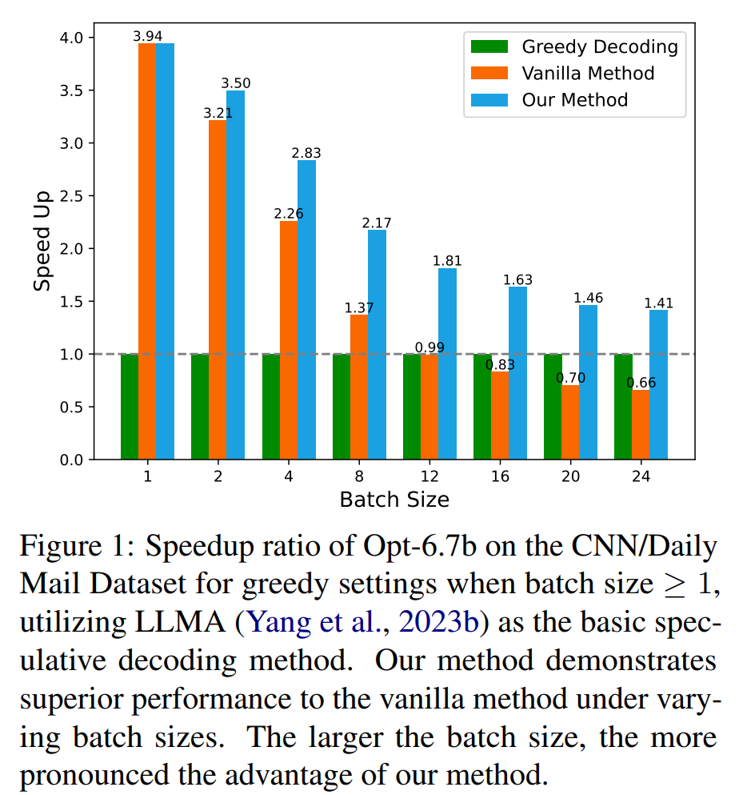
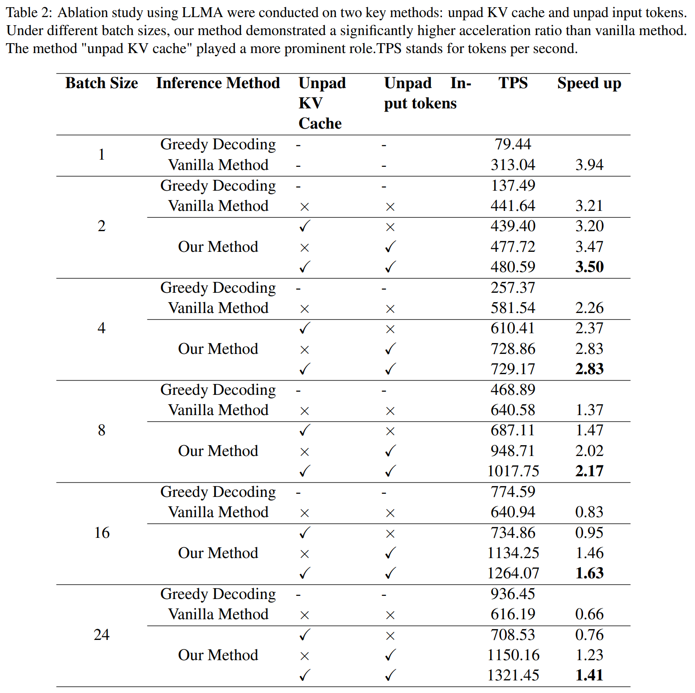

# EMS-SD: Efficient Multi-sample Speculative Decoding for Accelerating Large Language Models

arxiv preprint: https://arxiv.org/abs/2405.07542

## Abstract

Speculative decoding emerges as a pivotal technique for enhancing the inference speed of Large Language Models (LLMs). Despite recent research aiming to improve prediction efficiency, multi-sample speculative decoding has been overlooked due to varying numbers of accepted tokens within a batch in the verification phase. Vanilla method adds padding tokens in order to ensure that the number of new tokens remains consistent across samples. However, this increases the computational and memory access overhead, thereby reducing the speedup ratio. We propose a novel method that can resolve the issue of inconsistent tokens accepted by different samples without necessitating an increase in memory or computing overhead. Furthermore, our proposed method can handle the situation where the prediction tokens of different samples are inconsistent without the need to add padding tokens. Sufficient experiments demonstrate the efficacy of our method.

## Methods

It should be noted that mainstream AI frameworks such as [PyTorch](https://pytorch.org/) only support **aligned key-value cache access**.
Consequently, two key requirements must be met for LLMs inference: 
(1) the number of tokens across different samples with in a batc must be equal prior to inference, and 
(2) the input token count must remain consistent for all samples during inference. 
To ensure uniformity, padding tokens are added to samples with varying token lengths. Additionally, attention masks are used to prevent the computation of padding tokens.

Vanilla Method tends to result in elevated computational and memory access overheads. 
In contrast, our approach does not entail such drawbacks,
thereby conferring a higher speedup ratio.

We have to point out that aligned KV cache access is not mandatory.
Then we present two key components of our approach:
* **Unpad KV cache.** This eliminates the need to add padding tokens when different samples accept different lengths in the verification phase. In particular, we specify the start location of the KV cache for each sample individually, rather than aligning writes in a manner similar to Pytorch.
* **Unpad input tokens.**  In general, prior to inputting into the Transformer network, all input tokens are concatenated together, and the number of input tokens for each sample is recorded. Additionally, during the attention result calculations, the CUDA kernel reconstructs the original batch indices and sequence positions for each token.






## Results






## Environments

Our proposedmethod in question necessitates the alteration of theCUDA kernel.
And We implemented our methodon the [FasterTransformer](https://github.com/NVIDIA/FasterTransformer) framework.

So you can to configure the environments following [FasterTransformer GPT Guide](https://github.com/NVIDIA/FasterTransformer/blob/main/docs/gpt_guide.md).

The main steps involved are as follows:
1. Install dependencies and compile C++ libraries.
2. Download huggingface opt model and convert, including opt-350m, opt-13b, etc.


## Reproduce our results

Run the following script `shell_ft_opt6.7b.sh` to reproduce our results on Opt-6.7b on the CNN/Daily Mail Dataset for greedy settings when batch size >= 1, utilizing [LLMA](https://arxiv.org/abs/2304.04487) and [Draft Model Predication](https://arxiv.org/abs/2211.17192).

## Citation

```
@article{ni2024ems,
Yunsheng Ni, Chuanjian Liu, Yehui Tang, Kai Han, Yunhe Wang
    author    = {Ni, Yunsheng and Liu, Chuanjian and Tang, Yehui and Han, Kai and Wang, Yunhe},
    title     = {EMS-SD: Efficient Multi-sample Speculative Decoding for Accelerating Large Language Models},
    journal = {arXiv preprint arXiv:2405.07542},
    month     = {May},
    year      = {2024}
}
```

## Acknowledgements

1. We used [FasterTransformer](https://github.com/NVIDIA/FasterTransformer) framework to 
implement our method.
2. We used [LLMA](https://arxiv.org/abs/2304.04487) as one of our base speculative decoding method.
3. We used [Draft Model Predication](https://arxiv.org/abs/2211.17192) as one of our base speculative decoding method.

